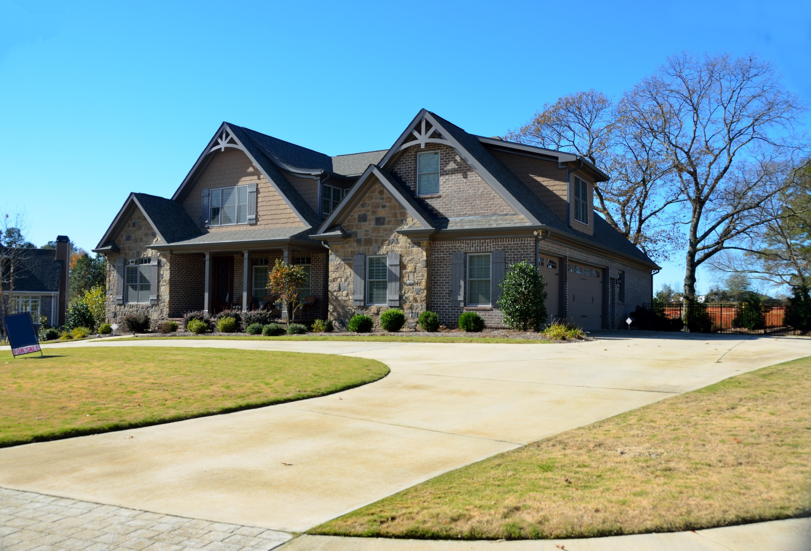
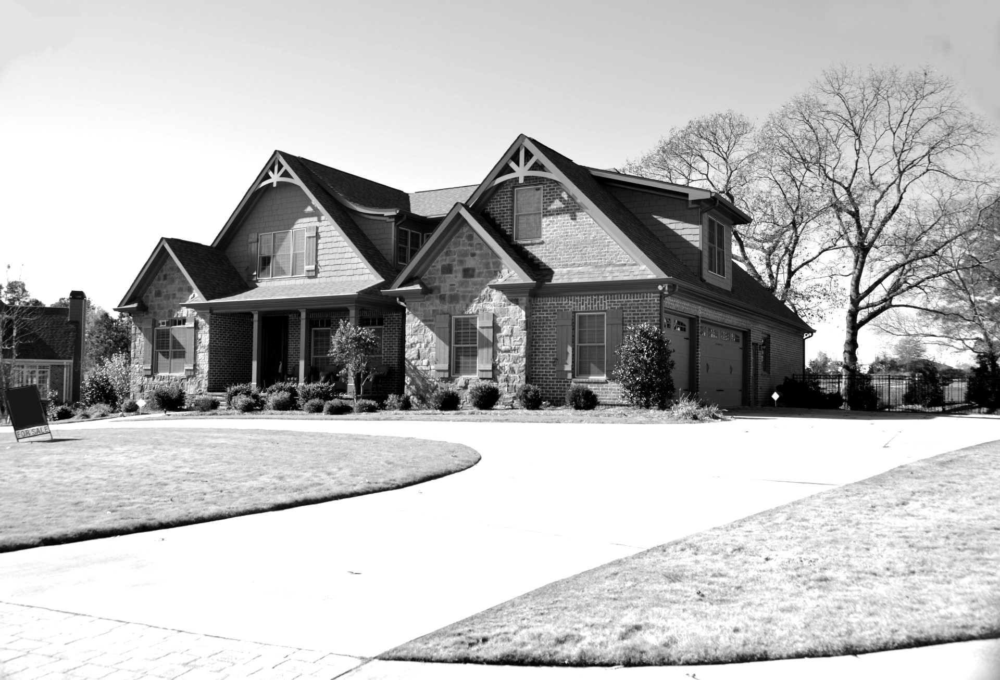
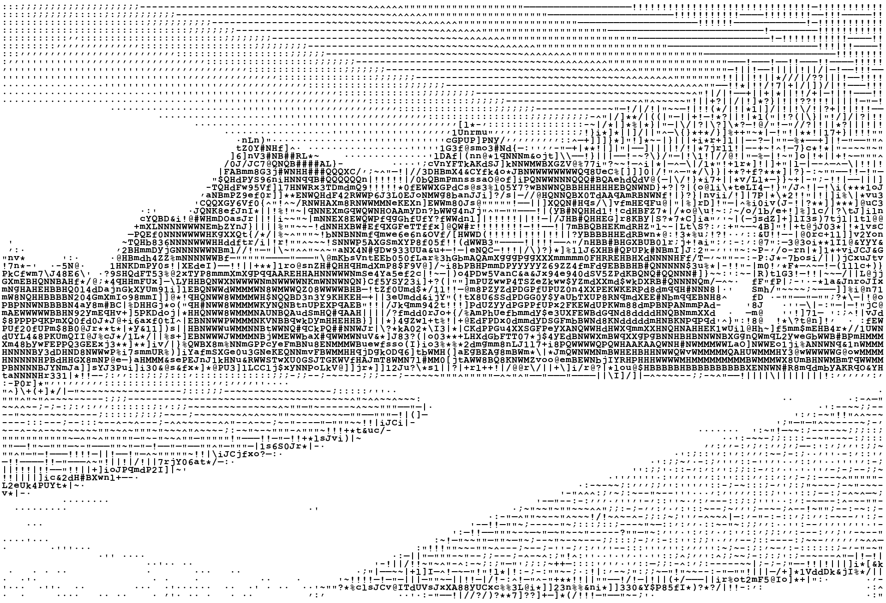
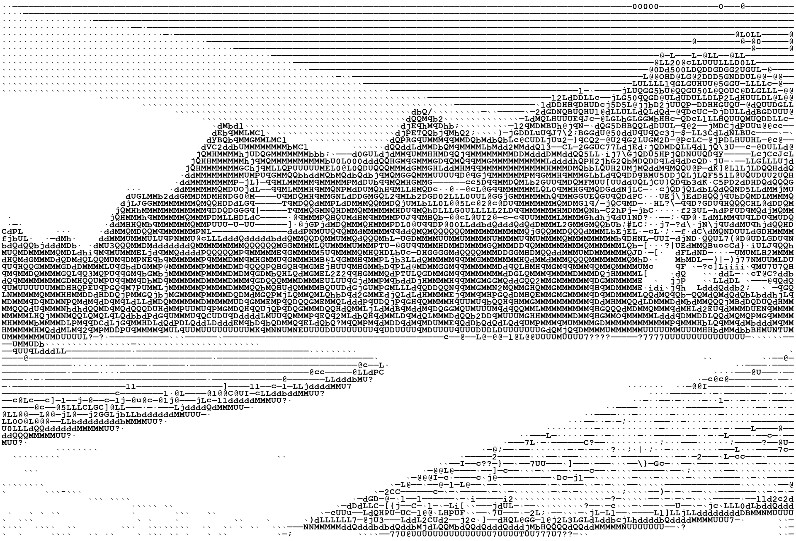
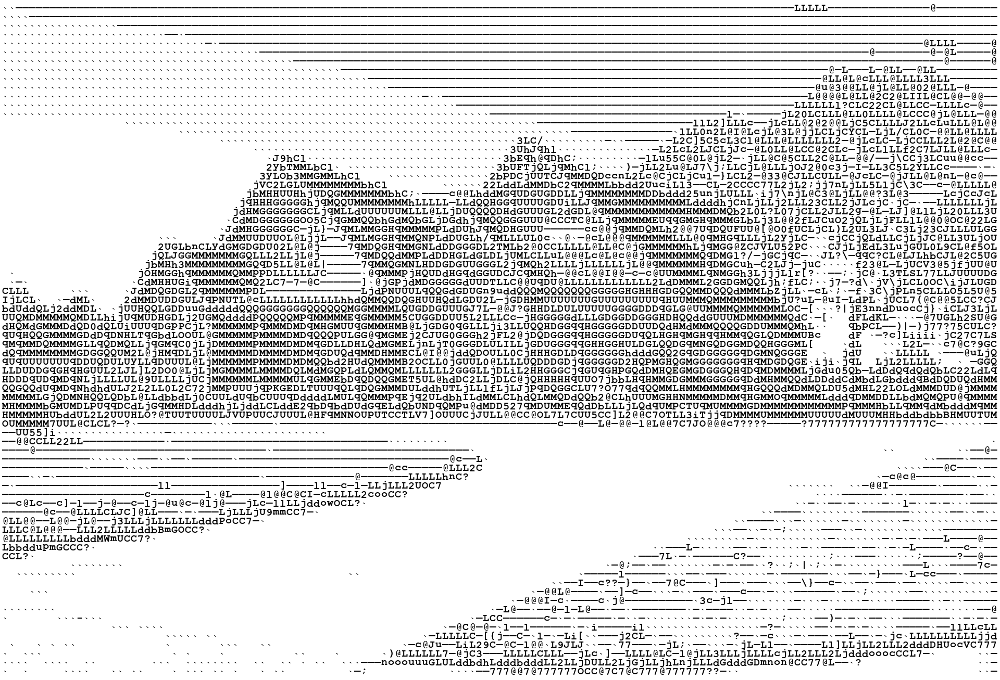
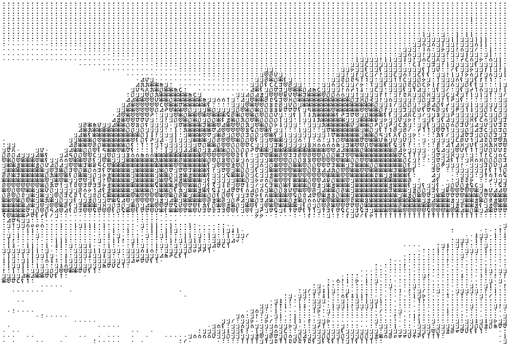

# AdvancedAsciiArt
Create precise ASCII art with any font.
Highly configurable, for single files or entire batches.

## What makes it *advanced*?
This script offers **three** metrics by which to choose the most optimal character:
___
#### LUM
The _luminance_ metric evaluates the average brightness of a given part of the image, 
and finds the best match solely on brightness. This is the conventional method for making ASCII art.  
**Pros:**
  * Fast
  * Accurate brightness values

**Cons:**
  * Very little detail
  * Blocky appearance
---
#### DCT
The _[discrete cosine transform](https://en.wikipedia.org/wiki/Discrete_cosine_transform)_ metric 
applies the same algorithm involved in compressing jpeg images to determine the main features.
This way, it will attempt to preserve lines and edges, generally preserving the shape of the part it 
is trying to resemble.  
**Pros:**
  * Crisp edges and defined lines
  * Retains a lot of finer details

**Cons:**
  * Slow
  * Has trouble picking appropriate or consistent brightness values
---
#### MIX
The _mixed_ metric makes the best of both worlds, using the lum metric to select a number of candidates
that fit the brightness most accurately, then using the dct metric on this reduced set to select the 
character that best fits the shape to preserve fine details.  
**Pros:**
  * Moderately fast
  * Both accurate brightness values and sharp edges

**Cons:**
  * Still slower than lum
---
### See the difference
_Note: to improve results, try increasing the brightness and/or contrast of your image. 
You do not need to make them grayscale beforehand._

Original|Slight tweaks
--------|------------
|

LUM|DCT|MIX
---|---|---
||

[Image source](https://www.publicdomainpictures.net/en/view-image.php?image=136181&picture=new-home-for-sale)

### Use any font
Traditionally, ASCII art is meant to be printed as plain text, which requires a monospace font to work.
Exporting straight to an image though, avoids this issue and allows for more possibilities.
The script will automatically center any character and can adjust the bounding box appropriately,
meaning any font, including glyphs, are supported, as long as pillow can draw them. 
Simply supply a path to a .ttf file. _Note: you may need to exclude a number of characters._

|Glyph font|
|--------|
||

### Highly configurable
There are many settings you can tweak to get the output just right. Sometimes changing a few settings 
is necessary to get good results.

## How to run it
```
python main.py
```
The current working directory will be set automatically to `\AdvancedAsciiArt\`.

## Dependencies
Install with pip:
```
pip install -r requirements.txt
```
Packages:
```
numpy
pillow
scipy
logzero
pathlib2
```
## Configuration
When run, the script will check for the existence of a `config.json` file.
Should the file be missing or corrupted, a new file will be generated.

Default values of config.json:
```json
{
    "general": {
        "image_path": "cc0_house_tweaked.jpg",
        "output_as_txt": false,
        "prompt_confirmation": "first",
        "pad_to_original_size": true,
        "pad_centered": true,
        "remove_trailing_whitespace": true,
        "scale_input_width": 1.0,
        "scale_input_height": 1.0,
        "logging": "info",
        "progress_interval": 25,
        "allowed_file_types": [
            ".bmp",
            ".png",
            ".jpg",
            ".jpeg",
            ".tiff"
        ],
        "ignore_invalid_types": true
    },
    "font_settings": {
        "font_path": "courbd.ttf",
        "ASCII_whitelist": "0123456789abcdefghijklmnopqrstuvwxyzABCDEFGHIJKLMNOPQRSTUVWXYZ!\"#$%&'()*+,-./:;?@[\\]^_`{|}~",
        "ASCII_blacklist": "",
        "text_out_whitespace": " ",
        "font_size": 20,
        "auto_size": true,
        "character_width": 2,
        "character_height": 2,
        "size_as_padding": false,
        "force_square": false
    },
    "method": {
        "metric": "mix",
        "white_threshold": 250,
        "normalize_luminosity": true,
        "DCT_cutoff_low": 3,
        "DCT_cutoff_high": 2,
        "Mix_threshold": 0.5
    }
}
```
### General
* **image_path** 
  For a given file or directory name it will test for its existence in `\AdvancedAsciiArt\image_in\`.
  If an absolute path is given, the script will load from there instead. 
  _Note: the output directory will always be `\AdvancedAsciiArt\image_out\`._
* **output_as_txt** When `true`, the raw text will be output to a txt file, otherwise a _.png_ image.
* **prompt_confirmation** Can be set to: `each`, `first`, or `none`.
  Determines whether to ask if you would like to save the current image and, 
  potentially, continue to the next.
* **pad_to_original_size** The output image size may vary depending on the given font size.
  If set to `true`, the output image will be resized to match the original.
* **pad_centered** When `false`, padding is added only to the right and bottom, 
  otherwise it is padded equally on all sides.
* **remove_trailing_whitespace** _Affects text file output._ When `true`, trailing whitespace characters
  are stripped from the right.
* **scale_input_width** _Intended for text output._ Scale the image to adapt to additional character spacing.
  _Note: set to 1 if intending to output as an image. [More on calibration](#Text-Output-Calibration)_
* **scale_input_height** _Intended for text output._ Scale the image to adapt to additional line spacing.
  _Note: set to 1 if intending to output as an image. [More on calibration](#Text-Output-Calibration)_
* **logging** Set the desired log level: `debug`, `info`, `warning`, `error`. 
  Lower levels will be suppressed in the console. No log file is created either way.
* **progress_interval** While processing, progress reports are given every *x* percent at `info` priority.
* **allowed_file_types** Set a list of valid file types to load. 
  _Note: only file types supported by [pillow](https://pillow.readthedocs.io/en/stable/handbook/image-file-formats.html)
  are valid._
* **ignore_invalid_types** When `false`, encountering an invalid file type will raise an exception.

### Font settings
* **font_path** First the script will attempt to find the file in `\AdvancedAsciiArt\fonts\`, 
  then `C:\Windows\Fonts\`. If an absolute path is given, the script will load from there instead.
* **ASCII_whitelist** List of characters the script will use.
* **ASCII_blacklist** Optional list of characters to exclude from the whitelist at runtime.
* **text_out_whitespace** _Affects text file output._ Set the character to use when the `white_threshold` is reached.
  By default, this will be a simple space.
* **font_size** The size all characters will be drawn at.
* **auto_size** When `true`, the minimal size to fit all characters is used,
  and the following width and height are ignored. 
* **character_width** Fixed width all characters are limited to.
* **character_height** Fixed height all characters are limited to.
* **size_as_padding** When `true`, the above sizes are instead added to the minimal size required for all characters.
* **force_square** When `true`, the height and width are made equal, preferring the larger of the two.

### Method
* **metric** Choose from `dct`, `lum`, `mix`.
* **white_threshold** If the average brightness of the image for a given region reaches this value, 
  it will simply be white. _Note: this behavior can be disabled by setting a value greater than 255._
* **normalize_luminosity** _Affects the lum and mix metrics._ When `true`, the average brightness of 
  character samples is interpolated to cover the entire brightness range. 
  This will prevent the single brightest and darkest characters from dominating the brightness levels at the outer limits. 
* **DCT_cutoff_low** _Affects dct and mix metrics._ The number of low frequency bits to preserve from
  the discrete cosine transform that dictate the rough shape.
* **DCT_cutoff_high** _Affects dct and mix metrics._ The number of high frequency bits to preserve from
  the discrete cosine transform that dictate the finer patterns, here: brightness.
* **Mix_threshold** _Affects the mix metric._ Can be a percentage when in the range of ]0, 1[ or 
  an absolute value for values >= 1. This determines how many of the best candidates of the lum metric to present to the dct metric.

## Text Output Calibration
When pasting art as text into another program, the character and line spacing may change. To correct distortions,
it is best tweak the scale factors. In order to find the optimal values, you can use the _testbox.png_ image
to find what values preserve its square shape.  
For Discord, I've found that a width of 1.1 and a height of 0.6 are pretty good.

## TODO:
- [x] Allow for plain text output (Only works with monospace fonts)
